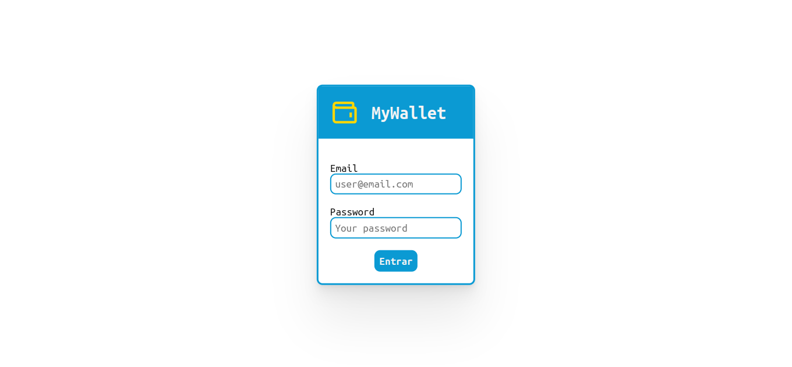
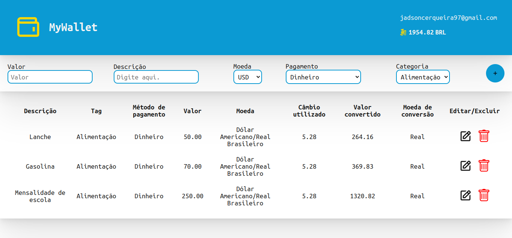

# Projeto Wallet

## Contexto
Este projeto foi desenvolvido com o intuito de consolidar os estudos da biblioteca __React__ durante o curso de Desenvolvimento Web na Trybe.

Aqui o objetivo foi construir um gerenciador de gastos em diferentes moedas utilizando __React__ e __Redux__ para gerenciar o estado da aplicação. O valor de conversão de cada moeda é obtido via __API__ no momento do registro da despesa. O destaque do Wallet está na centralização do estado da aplicação no __Redux__ de forma que os componentes armazenam suas informações mediante execução de um __dispatch__ e os componentes tem acesso a essas informações da __store__ por meio do método __mapStateToProps__.

<details>
<summary>Veja um preview da aplicação
</summary>





</details>

### Tecnologias usadas

> Desenvolvido com: React, Redux, CSS3, HTML5, ES6

### Executando aplicação
No diretório raiz do projeto execute o comando abaixo para instalar as dependências.
```bash
npm install
``` 
Para executar o projeto:
``` bash
npm start
```